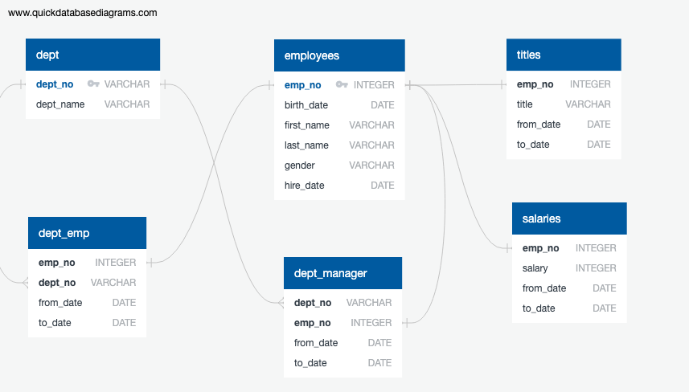
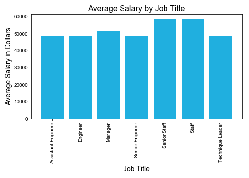

# Employee Database

Several datasets containing various employee information are extracted, transformed, and loaded into a new database. An entity relationship diagram (ERD) was created from http://www.quickdatabasediagrams.com. PostgreSQL, Python and the SQLAlchemy library using Jupyter Notebook were used to carry out the ETL process.

These relationships are used for stacking query statements. Refer to the following documents for details:
* `schemata_SooBin.sql` for the schema for ERD
* `ERD.png` for the established ERD
* `query_SooBin` for main query statements
* `bonus_SooBin.ipynb` for the analysis

The following picture illustrates average salary by the job title:

